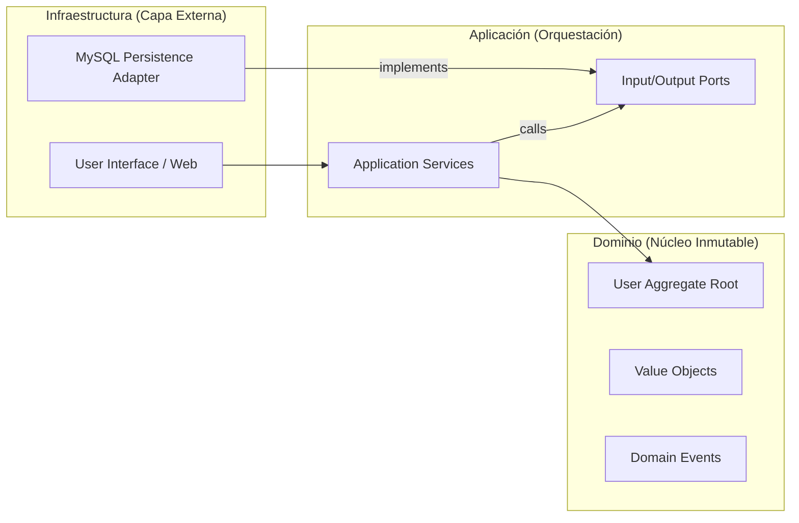

# HexaUser Mastery 💎
### *Enterprise-Grade User Management with Hexagonal Architecture*

---

**HexaUser Mastery** es un ecosistema de gestión de usuarios construido sobre los cimientos de la **Ingeniería de Software moderna**. Este proyecto no es solo un CRUD; es una implementación rigurosa de **Arquitectura Hexagonal**, **Domain-Driven Design (DDD)** y **CQRS** en PHP 8.2, diseñada para demostrar cómo el desacoplamiento total permite crear sistemas resilientes, testeables y evolucionables.

---

## 🖼️ Visual Showcase
Experimenta una interfaz de usuario premium diseñada con una estética de vanguardia (*Glassmorphism*).

| Inicio del Sistema | Gestión de Usuarios | Creación de Perfiles |
|:---:|:---:|:---:|
|  |  |  |

---

## 🏗️ Arquitectura y Diseño de Software

El corazón de este proyecto es la **separación de intereses**. La lógica de negocio reside en el centro, protegida de los cambios en la infraestructura externa.



### Análisis de Responsabilidades por Capa

| Capa | Responsabilidad | Componentes Clave |
| :--- | :--- | :--- |
| **Dominio** | Lógica de negocio y reglas de integridad. | `UserModel`, `UserEmail`, `UserRoleEnum`, `InvalidUserException` |
| **Aplicación** | Coordinación de flujos y orquestación de servicios. | `CreateUserService`, `UpdateUserService`, `CreateUserCommand` |
| **Infraestructura** | Detalles de implementación técnica y adaptadores. | `UserRepositoryMySQL`, `UserController`, `View Engine` |

---

## 🛡️ Patrones y Principios Aplicados

Para garantizar la máxima calidad del código, se han implementado los siguientes estándares:

- **SOLID Principles:** Especialmente el principio de *Inversión de Dependencias* (DIP).
- **Domain-Driven Design (DDD):** Uso de **Aggregate Roots**, **Value Objects** y **Domain Events**.
- **CQRS:** Separación clara entre comandos (mutaciones de estado) y consultas (lectura de datos).
- **Repository Pattern:** Abstracción total del acceso a datos.
- **Dependency Injection (DI):** Gestión centralizada de dependencias mediante un contenedor custom.
- **Clean Code:** Código autodocumentado, tipado estricto y sin efectos secundarios.

---

## 📁 Estructura del Proyecto

```text
├── public/                 # Punto de entrada (Frontend Controller)
├── src/
│   ├── Domain/             # Reglas de negocio puras (Inmutable)
│   ├── Application/        # Servicios y Puertos (Orquestación)
│   ├── Infrastructure/     # Adaptadores MySQL, Web y Presentación
│   └── Common/             # Framework Core (DI, ClassLoader)
├── tests/
│   ├── Unit/               # Pruebas de lógica de dominio
│   └── Integration/        # Pruebas de persistencia real
├── img/                    # Activos visuales de documentación
└── docker/                 # Configuración de virtualización
```

---

## 🚀 Despliegue Rápido

### Usando Docker (Recomendado)
Levanta todo el ecosistema (PHP 8.2 + MySQL 8.0) en segundos:
```bash
docker-compose up -d --build
docker-compose exec app composer install
```
🔗 Acceso: **[http://localhost:8080](http://localhost:8080)**

### Instalación Local
1. Configura tu base de datos en `src/Infrastructure/Adapters/Persistence/MySQL/Config/Connection.php`.
2. Ejecuta `composer install`.
3. Inicia el servidor: `php -S localhost:8000 -t public`.

---

## 🧪 Suite de Pruebas Profesionales

Garantiza la estabilidad del sistema ejecutando nuestra suite completa de PHPUnit:

```bash
docker-compose exec app vendor/bin/phpunit
```


---
*Desarrollado con el compromiso de crear software excepcional.*
